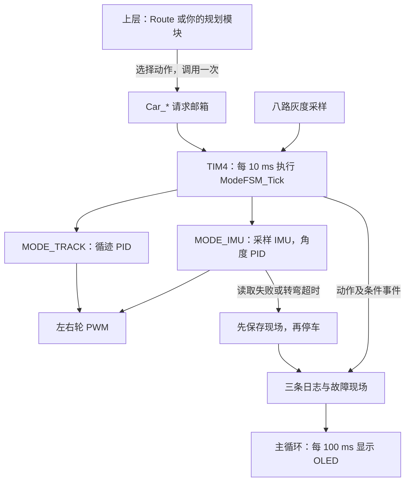

**小车状态机与 OLED 日志使用指南**

本指南对应当前工程代码。动作执行、路线选择与 OLED 显示已经接通；下面的示例供你选择使用，没有自动修改 `main.c` 的启动行为。

**1. 先理解各模块的职责**

| 文件 | 职责 | 你主要怎样使用 |
| --- | --- | --- |
| `App/Mode_FSM/Mode_FSM.h` | 动作接口和运行状态 | 调用 `Car_*()`，用 `ModeFSM_GetSnapshot()` 读状态 |
| `App/Route/Route.c` | 条件确认和示例路线 | 调整前移时间，替换路线选择策略 |
| `App/Route/Route.h` | 自动决策开关和检测结果 | 调用 `Route_Enable()` |
| `App/IMU_Task/IMU_Task.c` | IMU 转弯、直行 PID | 调试控制参数，日常发动作不必直接调用这里的控制函数 |
| `App/Track_Task/Track_Task.c` | 灰度循迹 PID | 调试循迹速度和 PID 参数 |
| `App/Debug_Log/Debug_Log.h` | 手动事件记录 | 调用 `DebugLog_Write()` |
| `Core/Src/main.c` | 初始化、前台显示、通信重试 | 放一次性的启动请求或上层轮询逻辑 |



每个控制帧只运行当前模式的控制器。循迹时暂停 IMU 采样与解算；IMU 模式仍读取灰度用于条件检测，循迹 PID 不运行。这里的“关闭”指暂停相应控制功能，没有切断传感器供电。

**2. 当前上电后会做什么**

`main.c` 已初始化电机、循迹、状态机、日志、IMU 和 OLED，随后启动 TIM4。默认进入 `MODE_TRACK`，`Route` 自动决策默认开启，因此定时器启动后小车会开始循迹。

当前示例路线：

- 左路口：连续三帧确认 → IMU 保持航向前移 80 帧 → 左转 90° → 自动接循迹。
- 右路口：连续三帧确认 → IMU 保持航向前移 80 帧 → 右转 90° → 自动接循迹。
- 十字路口：连续三帧确认 → IMU 保持航向直行 10 帧 → 自动接循迹。

一帧为 10 ms，所以 80 帧约 0.8 秒，10 帧约 0.1 秒。这是按时间近似前移，不能直接换算为固定厘米数，仍需根据实际车速校准。

路口判断按八路灰度的 IN1 至 IN8：左四路同时在线为左路口，右四路同时在线为右路口，八路同时在线优先判为十字。在线电平由 `Track_Task.h` 的 `LINE_RAW_VALUE` 决定，当前为 1；OLED 上的 `G` 已换算为“1 表示在线”。

同一个路口只触发一次，连续三帧离开路口后才能再触发。重新开启自动路线不会重放已经触发的路口事件。

**3. 五类动作怎样调用**

在使用接口的文件加入：

```c
#include "Mode_FSM.h"
#include "Route.h"
#include "Debug_Log.h"
```

| 调用 | 接受后做什么 | 后续行为 |
| --- | --- | --- |
| `Car_Track();` | 灰度循迹 PID 接管 | 持续跟线；开启 Route 时按路口选择动作 |
| `Car_ImuForward();` | 以接受动作时的朝向为 0°，保持该方向直行 | 持续到新动作或故障，没有内置距离或时间 |
| `Car_TurnLeft90(MODE_TRACK);` | 以本次动作起点为基准，目标 +90° | 完成后自动循迹 |
| `Car_TurnLeft90(MODE_IMU);` | 目标 +90° | 完成后自动沿转后航向直行 |
| `Car_TurnRight90(MODE_TRACK);` | 目标 -90° | 完成后自动循迹 |
| `Car_TurnRight90(MODE_IMU);` | 目标 -90° | 完成后自动沿转后航向直行 |
| `Car_Stop();` | 清 PID，并由控制入口输出两轮零 PWM | 保持停车，等待新的动作 |

左右转的参数表示**转弯完成后去哪一种模式**；转弯本身都使用 IMU 角度闭环。直接调用左右转是原地转弯，不包含 Route 的转前前移。

例如调用 `Car_TurnLeft90(MODE_IMU)`：本次基准从 0°开始，目标为 +90°，完成后 IMU 直行仍保持 +90°。不要再补调一次 `Car_ImuForward()`；这个接口会以当时的实际朝向重新建立 0°基准，原转弯目标就被重新设定了。

每次新的独立 IMU 动作都会重建自己的角度起点。连续两次左转各是相对当前朝向的 90°，OLED 的目标可能都显示 +90°，不能把它当作地图中的全局朝向。

**4. 自动决策开关怎么选**

```c
Route_Enable(1);  /* 使用当前示例路线自动安排路口动作。 */
Route_Enable(0);  /* 只监测条件，由你的上层代码决定动作。 */
```

上述两行是两种可选设置，不要按顺序都粘贴。单独测试循迹、IMU 直行和原地转弯时，先关闭示例路线，避免以后新的路口事件又自动发动作。

关闭开关不会停车，也不会切回循迹；当前 IMU 直行仍会继续，正在转弯的动作仍会由运动层完成并接预定模式。关闭后下一控制帧取消未完成的 Route 步骤。需要停车时另外调用 `Car_Stop()`。

**5. 启动时怎样选择一个测试动作**

在 `main.c` 的 IMU 初始化/校准结束之后、下面这行之前，放一组启动代码：

```c
HAL_TIM_Base_Start_IT(&htim4);
```

要先经过 `ModeFSM_Init()`、`IMUTask_Init()` 和传感器初始化，再提交请求；`ModeFSM_Init()` 会清空请求邮箱。以下每次只选择一组。

```c
/* 方案 A：纯循迹，不自动安排路口转弯。 */
Route_Enable(0);
Car_Track();
```

```c
/* 方案 B：IMU 保持启动时的朝向直行。 */
Route_Enable(0);
Car_ImuForward();
```

```c
/* 方案 C：右转 90°，然后自动接循迹。 */
Route_Enable(0);
Car_TurnRight90(MODE_TRACK);
```

```c
/* 方案 D：启动后停车，等待按键或上层代码提交动作。 */
Route_Enable(0);
Car_Stop();
```

要恢复当前默认自动循迹路线，可以删除你加的启动测试代码，或选择 `Route_Enable(1); Car_Track();` 这一组。

**6. 动作请求的时序必须理解**

`Car_*()` 只把请求写入一个邮箱，不在函数调用期间完成运动。正常情况下下一次 10 ms 控制帧接受请求，清 PID 历史、建立角度基准并执行对应控制。

```c
/* 不能这样表达“直行完再转弯”：没有动作队列，前一个请求可能被覆盖。 */
Car_ImuForward();
Car_TurnLeft90(MODE_TRACK);
```

如果状态机尚未取走第一个请求，邮箱最后只剩下左转请求。待处理的停车请求优先，后续运动请求不会覆盖它。

也不要在 `while (1)` 中每次都调用 `Car_ImuForward()` 或 `Car_TurnLeft90()`。这会反复初始化动作、角度基准、PID 和帧数；直行纠偏可能失效，转弯也无法正常完成或超时。

正确方法是：发一次动作 → 每次循环检查条件 → 条件满足时发下一动作一次。按键、串口指令或传感器条件也应在新事件发生时提交一次请求。

**7. 完整例子：直行约 2 秒 → 右转 → 再直行约 1 秒 → 停车**

只在运行此例时启用下面三处代码；保持现有 OLED 显示和通信重试逻辑。本例中动作请求只来自演示程序，`Route` 自动选择关闭。

粘贴前，先在 `main.c` 的 `/* USER CODE BEGIN Includes */` 区域补上 `#include "Route.h"`；当前该文件已有 `Mode_FSM.h` 与 `Debug_Log.h`。

第一处，在 `main.c` 的 `/* USER CODE BEGIN 0 */` 区域加入函数：

<!-- demo-code-begin -->
```c
/**
 * @brief 轮询演示路线，按动作帧数与转弯完成计数提交下一步。
 * @param 无。
 * @return 无。
 * @note 从主循环调用，检查间隔至少 10 ms；不直接采样、运行 PID 或写电机。
 *       配合启动前 Route_Enable(0) 与 Car_ImuForward 使用；每个动作只提交一次。
 *       转后 MODE_IMU 自动保持 -90°目标；发生故障或停车时不继续推进演示。
 *       静态步骤只在复位时初始化，重新演示需重新启动程序。
 */
static void Demo_Poll(void)
{
    static uint8_t step = 0u;
    static uint32_t turn_count_before = 0u;
    static uint32_t last_poll_ms = 0u;
    uint32_t now_ms = HAL_GetTick();
    ModeFSM_t car;

    /* 只轮询上层条件，10 ms 运动控制仍由 TIM4 独占。 */
    if ((uint32_t)(now_ms - last_poll_ms) < 10u) {
        return;
    }
    last_poll_ms = now_ms;
    ModeFSM_GetSnapshot(&car);

    /* 故障和停车期间不提交新动作，保留故障现场。 */
    if (car.status != CAR_RUNNING) {
        return;
    }

    switch (step) {
    case 0u:
        /* 等待启动的 IMU 直行动作实际接受，并执行约 200 × 10 ms。 */
        if (car.mode == MODE_IMU && car.imu_state == IMU_FORWARD &&
            car.state_frames >= 200u) {
            turn_count_before = car.turn_count;
            Car_TurnRight90(MODE_IMU);
            step = 1u;  /* 立即切换等待步骤，防止主循环重复提交右转。 */
        }
        break;

    case 1u:
        /* 完成计数改变才表示转弯完成，CAR_RUNNING 不能作为完成条件。 */
        if (car.turn_count != turn_count_before) {
            step = 2u;
            /* 运动层已经接上 IMU 直行，不能再发直行请求重建角度基准。 */
        }
        break;

    case 2u:
        /* 转弯完成时动作帧数已重新计数；沿转后航向走约一秒。 */
        if (car.mode == MODE_IMU && car.imu_state == IMU_FORWARD &&
            car.state_frames >= 100u) {
            Car_Stop();
            step = 3u;
        }
        break;

    default:
        break;  /* 演示结束，等待下一控制帧接受停车。 */
    }
}
```
<!-- demo-code-end -->

第二处，在传感器初始化结束后、TIM4 启动前加入：

```c
Route_Enable(0);
Car_ImuForward();
```

第三处，在现有 `while (1)` 的循环体内加入：

```c
Demo_Poll();
```

这里没有长时间 `HAL_Delay()` 或阻塞等待，所以主循环还能持续显示 OLED、重试通信。时间按动作接受后以及转弯完成后的帧数计算；采样相位和前台通信可能延后下一动作请求，因此使用“约两秒/约一秒”。需要更及时的步骤切换时，把轻量条件判断放到 Route 的 10 ms 入口。这是运动时长示例，不是距离闭环。

**8. 怎样读状态和判断完成**

主循环用快照接口：

```c
ModeFSM_t car;
ModeFSM_GetSnapshot(&car);
```

| 字段 | 你能知道什么 |
| --- | --- |
| `car.status` | 运行、停车或故障 |
| `car.mode` | 当前由循迹还是 IMU 控制 |
| `car.imu_state` | IMU 直行、左转或右转 |
| `car.state_frames` | 当前动作帧数，一帧 10 ms，动作切换后重新计数 |
| `car.turn_count` | 已完成转弯总数；发起前保存，之后比较是否变化 |
| `car.command_id` | 接受请求的序号，变化表示有请求被处理，不等于动作已完成 |
| `car.imu_valid` | 本控制帧是否取得有效 IMU 角度；与通信就绪标志不同 |
| `car.fault` | IMU、转弯超时或指令参数故障 |

`CAR_RUNNING` 在直行与转弯期间都成立；判断转弯完成要比较 `turn_count`，不能只看运行状态。非法请求也会更新 `command_id`，需要结合 `status/fault` 判断是否成功。

`g_route.junction_event`、`line_found_event` 和 `line_lost_event` 只保持一个控制帧，即 10 ms，主循环可能错过。当前 Route 与日志已在该控制帧消费这些事件；不要另写主循环轮询来假定能捕获每个短事件。需要前台规划时，应增加锁存或传递接口，并让 TIM4 只执行已经算好的路线步骤。

**9. OLED 应该怎么看**

```text
FAULT L90 R:TURN
Y:+37.2 T:+90.0
E:+52.8 N:300
G:00000000 I:1
L:-427 R:+427
12 I JUNC_L
13 I L90>TRK
16 E TURN_TO
```

- 第一行：运行状态、动作和 Route 步骤。手动转弯时 Route 可能仍为 `FOLLOW`，表示没有自动路线步骤；动作仍显示 `L90/R90`。
- `Y/T/E`：当前相对角度、目标、最短角差，单位为度。上例还差约 52.8°。
- `N`：本次动作帧数；300 帧为约 3 秒。
- `G`：IN1 至 IN8 的在线情况，1 表示在线。
- `I`：IMU 通信就绪；1 不保证本帧角度有效。
- `L/R`：左右轮有符号 PWM 指令，不是实测速度。
- 最后三行：开机秒数、等级、短消息；最新一条在底部。

循迹期间 `Y/T/E` 显示 `--`；IMU 本帧无效时 `Y/E` 显示 `--`，有限目标 `T` 仍可显示。超过 ±999.9°以及 NaN/Inf 不显示数值。

手动加日志：

```c
DebugLog_Write(LOG_INFO, "CHECK_POINT");
DebugLog_Write(LOG_WARN, "WAIT_LINE");
DebugLog_Write(LOG_ERROR, "USER_ERR");
```

固定保存最近三条，每条最多 11 个英文字符，超过截断。空指针和空字符串忽略，百分号为普通文本，不接受 printf 参数。记录接口可用于主循环或中断，但只在事件发生时调用，不要每帧刷同一条消息。

`DebugLog_Write(LOG_ERROR, ...)` 只写一条错误级别事件，屏幕用 E 表示，不会主动停车或冻结现场。运行故障由运动层自动停车并调用 `DebugLog_CaptureFault()`。普通使用不必手动调用 CaptureFault、ClearFault 或再次 Init。

首次故障会保存停车前 PWM 并冻结屏幕，所以真实电机已经停止，OLED 仍可能显示原先的非零 PWM。普通 `Car_Stop()` 保留冻结现场；接受新的有效运动动作后自动解除冻结。通信恢复只恢复通信，不会自动让车继续跑。OLED 失败按一秒重连，恢复后重绘，历史不清空。

**10. 哪些参数影响使用**

| 文件与参数 | 当前值 | 用途 |
| --- | --- | --- |
| `Route.c` 的 `ROUTE_CONFIRM_FRAMES` | 3 帧 | 确认路口及有线/无线条件 |
| `Route.c` 的 `ROUTE_APPROACH_FRAMES` | 80 帧 | 转前前移时长，约 0.8 秒 |
| `Route.c` 的 `ROUTE_CROSSING_FRAMES` | 10 帧 | 十字路口穿越时长，约 0.1 秒 |
| `Mode_FSM.c` 的 `TURN_DONE_TOLERANCE` | 7° | 误差绝对值小于此值才累计完成帧 |
| `Mode_FSM.c` 的 `TURN_DONE_FRAMES` | 3 帧 | 连续满足容差才完成 |
| `Mode_FSM.c` 的 `TURN_TIMEOUT_FRAMES` | 300 帧 | 转弯 3 秒超时停车 |
| `IMU_Task.c` 的 `FWD_BASE_SPEED` | 400 | IMU 直行基础 PWM |
| `IMU_Task.c` 的 `FWD_DEADBAND` | 10° | 小误差送入直行 PID 前归零 |
| `Track_Task.c` 中初始化的 `base_speed` | 400 | 循迹基础 PWM |
| `Track_Task.h` 的 `LINE_LOST_SCALE` | 0.6 | 循迹丢线时输出降速比例 |

目前 IMU 直行保留原来的 10°死区，因此小于 10°的角度误差不会产生新的误差纠偏输入，并不能保证很小的航向偏差也被主动纠正。上车观察 `Y/E` 再决定是否调整，先确认方向、电平与时序。

循迹丢线会沿用最近偏差并降速，目前不会自动停车。日志的 `W LINE_OFF` 表示丢线提醒，停车条件需要上层另行规定。

**11. 后续路径规划怎样接入**

一种做法是把规划结果交给现在的 Route：保持 `Route_Enable(1)`，替换 `select_route_action()` 的方向选择，保留确认、前移、转弯等待等执行步骤。耗时的路径搜索放主循环，10 ms 入口只读取准备好的下一路线步骤。

另一种做法是由你另写规划模块负责动作：先 `Route_Enable(0)`，该模块在条件满足时发一次 `Car_*()`，像演示程序一样等待时长或完成条件，再发下一动作。短暂传感器事件需要可靠地锁存并交给前台使用。避免两处同时安排不同的动作请求。

地图位置、全局方向、已经走过的路口数和路线索引由上层保存。当前 `target_yaw/yaw` 是每次 IMU 动作的局部基准，不能直接充当全局定位；当前接口也没有距离闭环。

**12. 使用时保留现有调度关系**

- TIM4 每 10 ms 唯一调用 `ModeFSM_Tick()`，不要在主循环再调用一次。
- `Route_Tick()` 已被运动层调用，不要重复调用。
- 不另行调用 `TrackTask_Tick()`、`follow_line()`、IMU Tick 或直接写电机，否则可能同时出现两个控制来源。
- `DebugLog_Display()` 已在主循环每 100 ms 调用，不要放入控制中断。
- 初始化函数只在启动阶段调用；OLED 重连只初始化 OLED，不重新初始化状态机或日志。
- 按键采用消抖后的按下事件发动作；串口每收到一个新命令提交一次。

软件测试与 Keil 编译已验证模块行为。示例中的机械运动、前移时间、PID 参数和 OLED 断线恢复效果仍需在实际小车上验证。
